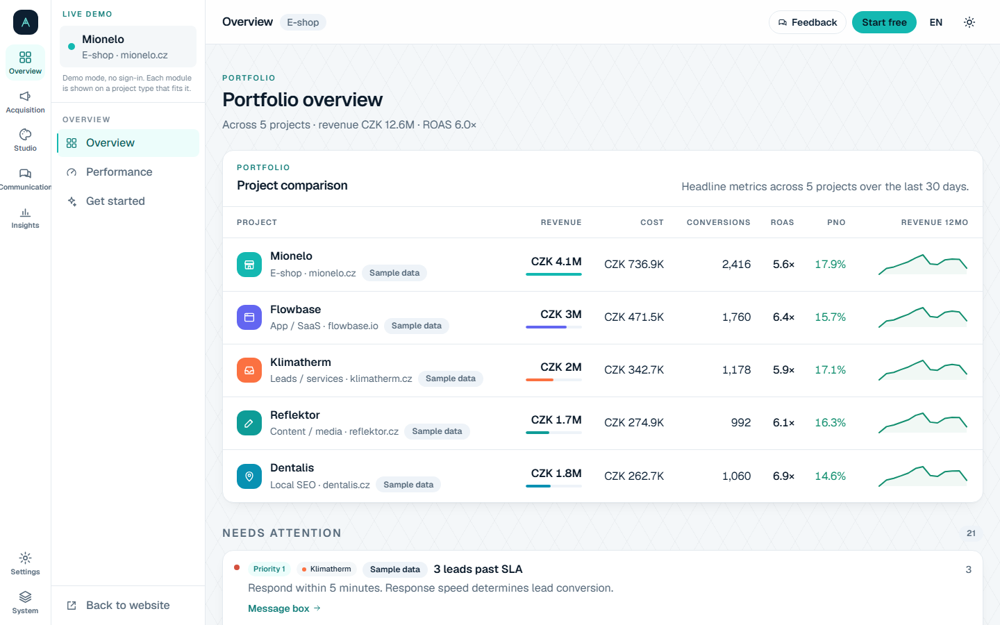

# Adamant — AI ad intelligence, on your machine


[](./LICENSE)

**[Česky →](./docs/README.cs.md)** · product profile: [`PRODUCT.md`](./PRODUCT.md) ·
the case against the alternatives: [`docs/value-case.md`](./docs/value-case.md)

## What it is

Adamant is an AI workspace for advertising, built for e-shop and agency
marketers. It ingests your live ad-channel data, tells you what the numbers
mean, and generates the assets those numbers call for — ad copy, articles,
social posts, creative visuals, keyword and local-SEO work — in one workspace
instead of a dashboard, a spreadsheet and a chat window side by side.
**Measure → triage → generate.**

Channel support, stated exactly: **Google Ads** is a live data connector (sync
and campaign edits), **Sklik** has ad-limit checks and keyword suggestions
(plus read-only stats sync with a token), **Meta** and **TikTok** are
publishing surfaces.

> **Sample data.** Public demos (homepage, `/dashboard`, microsites) run on the
> fictional client **Mionelo** (a nuts-and-superfoods e-shop). Every demo number
> is illustrative and labelled as such — none of it is a real customer's result.



## Two-minute local start

Requires **Node ≥ 22.5** (the local store uses `node:sqlite`).

```bash
npm install
npm run seed:local   # once — dev user + sample projects into .data/systedo.db
npm run dev:local    # http://localhost:3000 → open /app
```

`npm run dev:local` gives you a **fully offline** authenticated product at
`/app`: no Google OAuth, no Firestore, no API key. Open `/app/demo-eshop` for
the seeded sample project; the public site at `/` runs with an empty env file.

There is **no required API key**. With no provider configured, every AI
operation falls back to a deterministic demo result. Degrading without keys is
a **product property**, not a dev convenience. In dev, a logged-in Claude Code
CLI (`claude`) is picked up automatically and runs the AI tools on your
subscription; otherwise they stay in demo mode.

`npm run dev` is the cloud-auth mode (Google OAuth + Firestore credentials) —
you almost certainly do not want it on day one.

## Set it up with your AI

Open the repo in Claude Code and run **`/onboarding`** (a shared skill from the
organisation's AI registry, declared in `.ai/manifest.yaml`; its repo overlay
is [`.claude/onboarding/config.md`](./.claude/onboarding/config.md)). It probes
the machine, asks which capability groups you want, collects keys into
`.env.local`, boots the app and hands back a capability matrix — or run one
group, e.g. `/onboarding llm-engine`. Its source of truth is **`npm run doctor`**:
a read-only env preflight that prints what your `.env.local` actually switches
on (on / demo / off / error) plus the production-readiness matrix. Demo mode is
a supported state; doctor only exits non-zero on a real misconfiguration.

## Local vs hosted, honestly

Adamant is licensed under **AGPL-3.0-only** ([`LICENSE`](./LICENSE)). **It is
meant to run on your machine, on your models, on your data.** Nothing is held
back from this repository to sell elsewhere; a self-hosted install is intended
to be unmetered — no plans, no quotas — because the metering that exists is cost
control on the operator's own provider bill. There is no analytics SDK in the
tree and nothing phones home by default.

| | Self-hosted (this repo) | Hosted version |
| --- | --- | --- |
| Software | the whole product — reporting, campaign intelligence, the content engine and all its AI operations, Creative Studio, the brand-voice twin, keywords, local SEO, the catalog spine | the same code |
| Limits | none intended; rate limits are your own cost controls | fair daily limits (free during validation — see `/cena`) |
| Operations | yours: hosting, backups, upgrades, crons, HTTPS | handled |
| Provider credentials | you register your own (Google Ads developer token, Sklik token, Meta/LinkedIn apps) | approved credentials that cannot ship inside an open repo |

**If the hosted version is ever better than this repository, that is a bug.**

> **Status: not there yet.** A production build currently *requires* Firestore
> and Google OAuth, so self-hosting does not work today. What has to change,
> with file-level evidence, is in
> [`docs/open-source/impact.md`](./docs/open-source/impact.md); the agreed design
> for the fix — self-host mode, the auth seam, SQLite as a production store,
> BYOM/Ollama, packaging, crons, and a full external-egress inventory — is in
> [`docs/open-source/self-hosting.md`](./docs/open-source/self-hosting.md).

> **Note on the AGPL.** Run it internally however you like. If you modify Adamant
> and offer it to others over a network, §13 requires you to offer those users
> your modified source.

## What each key unlocks

Everything below is optional. Groups follow [`.env.example`](./.env.example);
`npm run doctor` reports the same states.

| Group | Keys | With it | Without it |
| --- | --- | --- | --- |
| AI engine | dev: a logged-in `claude` CLI, no key · prod: `GEMINI_API_KEY` | real model output from every AI tool (one chokepoint, `src/lib/llm`) | deterministic demo result for every operation |
| Sign-in + data store | dev: none (`dev:local` sets `DEV_AUTH` + `LOCAL_DB`) · cloud: `AUTH_SECRET`, `GOOGLE_CLIENT_ID/SECRET`, `GOOGLE_CLOUD_PROJECT`, a Firebase credential | real multi-user Google sign-in, Firestore data | offline synthetic user + local SQLite in dev; **hard-required in production** (see status above) |
| Ad connectors | `GOOGLE_ADS_DEVELOPER_TOKEN` (+ `GOOGLE_ADS_LOGIN_CUSTOMER_ID`), `SKLIK_API_TOKEN` | live campaign sync and edits (Google Ads, needs cloud sign-in); read-only stats (Sklik, one token per instance) | `/kampane` stays on clearly labelled demo data |
| Social publishing | `META_APP_ID/SECRET`, `LINKEDIN_CLIENT_ID/SECRET`, `TWIN_SMTP_URL` | real platform connections; the twin's outbound e-mail | demo connection per platform; e-mail channel degrades to "manual" |
| Creative Studio | `LEONARDO_API_KEY` + `GEMINI_API_KEY` (vision scoring, embeddings) | real image generation with vision-scored candidates; embedding search in the patterns library | deterministic SVG placeholders; lexical search |
| Crons + alerts | `CRON_SECRET`, `RESEND_API_KEY` (+ `ALERT_FROM_EMAIL`, `ALERT_WEBHOOK_URL`) | five scheduled jobs, alert e-mails, chat webhooks | crons **fail closed** (disabled, not open); alerts are logged, not sent |
| Admin + observability | `ADMIN_EMAILS`; `SENTRY_DSN`, `LIGHTTRACK_*`; rate/spend knobs | operator telemetry surfaces, error tracking, LLM tracing | admin **fails closed** (nobody is admin); Sentry never initialises; limits run on defaults |

**BYOM:** users paste their own provider key in the app (encrypted at rest,
AES-256-GCM) — six vendors: OpenAI, Anthropic, Gemini, OpenRouter, Qwen and
Ollama, so a local server via `OLLAMA_BASE_URL` / `OPENAI_BASE_URL` runs the
whole thing for free with no key at all.

## Where to go next

- **Contributing:** [`CONTRIBUTING.md`](./CONTRIBUTING.md) — setup, the
  verification gate (`npm run check:ci` and its pieces), and the conventions that
  bite. Contributions are accepted under a CLA: [`CLA.md`](./CLA.md) explains
  why; [`CODE_OF_CONDUCT.md`](./CODE_OF_CONDUCT.md) applies.
- **Security:** [`SECURITY.md`](./SECURITY.md) — never a public issue.
- **Model quality:** the public benchmark surface is `/kvalita-modelu`
  (LLM-as-judge scores across every AI operation); method and the latest
  measured BYOM table are in
  [`docs/testing/llm-quality-matrix.md`](./docs/testing/llm-quality-matrix.md).
- **Deploying the hosted flavour (Vercel):** [`docs/deploy.md`](./docs/deploy.md)
  — env names, crons, rollback, host rename. Cloud-connected setup (Google
  sign-in + Ads sync) is walked through in [`SETUP.md`](./SETUP.md), which is
  **partly stale** — it predates the offline path and narrates the maintainer's
  own GCP project.
- **Architecture and agent guide:** [`AGENTS.md`](./AGENTS.md) (stack in ten
  lines, commands, conventions), [`docs/design-system.md`](./docs/design-system.md),
  [`docs/i18n/contract.md`](./docs/i18n/contract.md), [`docs/open-source/`](./docs/open-source/).
- **History:** Adamant grew out of a case study ("Systedo case study"); the
  original brief, stack rationale and task write-ups are preserved unchanged in
  [`docs/case-study.md`](./docs/case-study.md).
